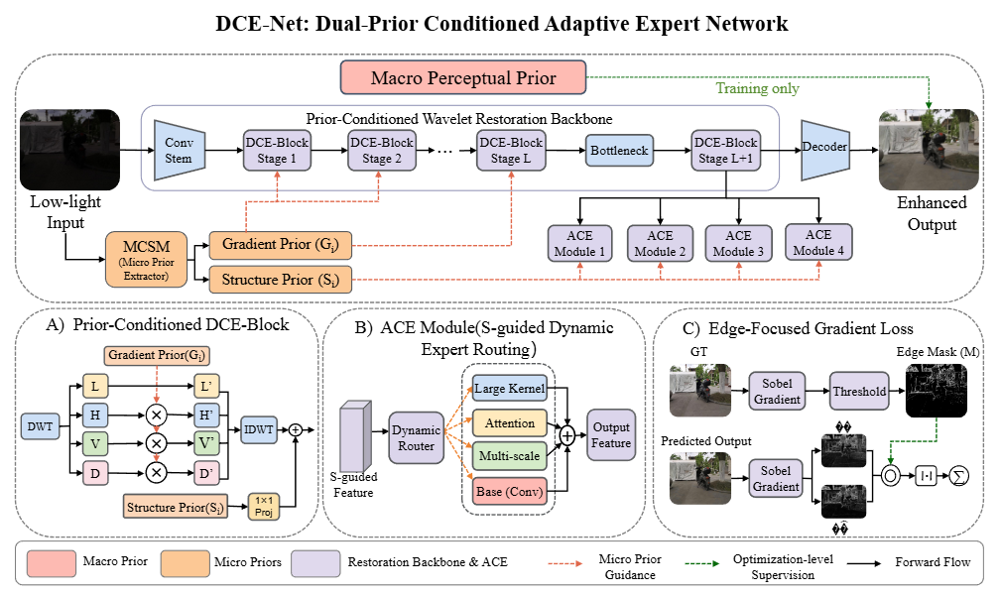
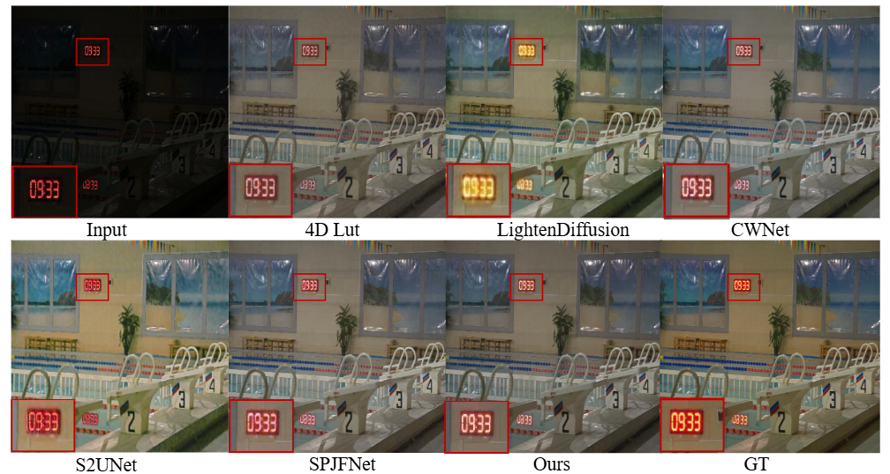
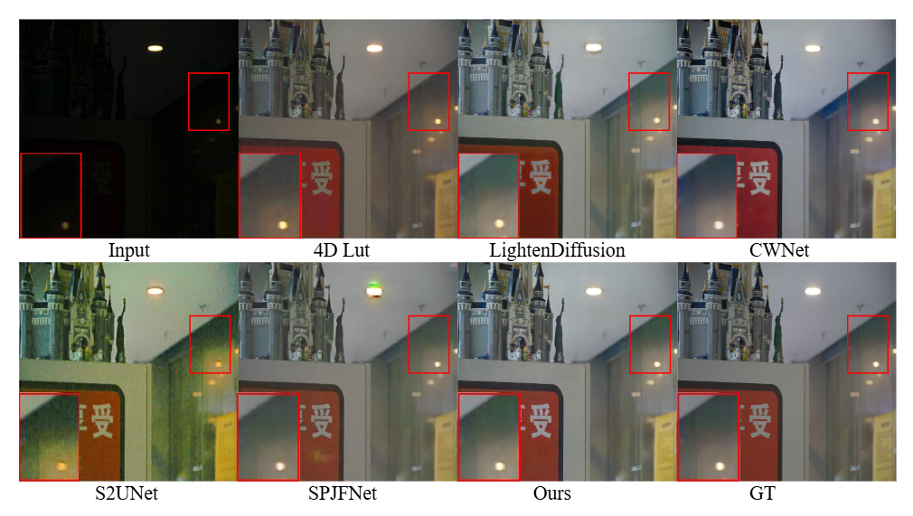
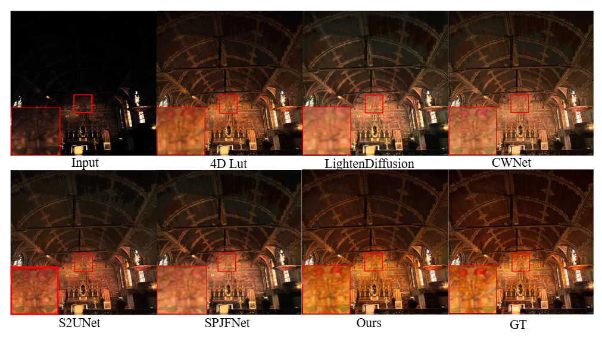

# DCE-Net: Dual-Prior Conditioned Adaptive Expert Network for Low-Light Image Enhancement

# Abstract

Low light image enhancement aims to improve the visibility of degraded images to meet the needs of human visual perception. The existing low light image enhancement methods focus on macro semantics and global perception, and lack of explicit modeling of fine-grained physical structure, which is easy to lead to the loss of micro details. At the same time, the static network is difficult to effectively deal with the complex hybrid degradation of spatial heterogeneity. Therefore, this paper proposes a double prior guided and adaptive expert network (DCE-Net). Firstly, the Micro-structure Conditioned Structure Mining (MCSM) mechanism is constructed to adaptively generate high fidelity gradient priors, and form a complementary dual-prior system with external semantics to realize the precise collaborative guidance of macro concept micro edge. Secondly, an Adaptive Conditioned Expert (ACE) mechanism is proposed, which distributes local features to heterogeneous expert subnetworks through pixel-level dynamic feature routing, and introduces differentiated restoration biases for different regions, so as to break through the restoration bottleneck of spatial heterogeneous degradation. On this basis, a high-frequency fidelity constraint strategy based on reliable edge mask is designed to dynamically focus on the real physical edge to replace the full band undifferentiated optimization, and effectively suppress artifacts and noise in the smooth region. Extensive experiments on several benchmark datasets show that DCE-Net shows significant advantages in both quantitative and qualitative evaluation.



### News

[**2026.6**] We release the initial version of DCE-Net, including code and basic testing scripts. <br>
[**2026.6**] More visual comparison results and pretrained models will be updated. <br>
[**2026.6**] The complete experimental results on LOL-v1, LOL-v2-Real, LOL-v2-Syn, and LSRW-Huawei will be released soon. <br>

# 🛠️ Preparation

### Clone the repo

```sh
git clone https://github.com/Xiaoggg221/DCENet.git
cd DCENet
```


# 🎫 Install

The environment configuration is provided in `environment.yml`. You can create a new conda environment by running:

```sh
conda env create -f environment.yml
conda activate dcenet
```

If you prefer to install dependencies manually, please refer to the package versions in `environment.yml`.

# 📦 Datasets

We conduct experiments on several widely used low-light image enhancement benchmarks, including:

* LOL-v1
* LOL-v2-Real
* LOL-v2-Syn
* LSRW-Huawei

Please organize the datasets according to your own local paths before training or testing. The detailed dataset preparation instructions will be updated soon.

# 💻 Training and Test

### Training

Run the following script to train the model:

```sh
python train.py
```

You can modify the training settings, dataset paths, and saving directories according to your own experimental environment.

### Testing

Run the following script to test the trained model:

```sh
python test.py
```

The testing results will be saved to the corresponding output directory.

# 🚀 Qualitative Results

### Overall Framework


### Visual Comparison on LOL-v1



### Visual Comparison on LOL-v2-Real



### Visual Comparison on LOL-v2-Syn



### Visual Comparison on LSRW-Huawei


### Downstream Object Detection Results


Compared with existing low-light image enhancement methods, DCE-Net can restore clearer structural details, suppress noise amplification, and maintain more natural visual consistency under complex low-light degradation. The downstream detection results further show that the enhanced images can provide more favorable visual conditions for high-level vision tasks.

# 📁 Project Structure

```text
DCENet/
├── assets/
│   ├── framework.png
│   ├── visual_lolv1.png
│   ├── visual_lolv2_real.png
│   ├── visual_lolv2_syn.png
│   ├── visual_huawei.png
│   └── detection_result.png
├── environment.yml
├── main.py
├── mods.py
├── train.py
├── test.py
└── README.md
```


# ✏️ Contact

If you have any questions, please contact:
Email: gaoxr@stu.cqut.edu.cn

